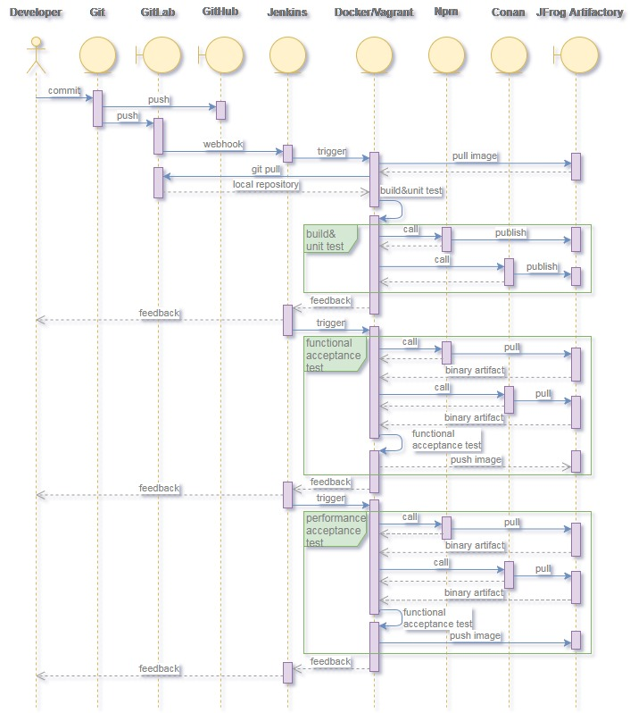

# WebStreamer DevOps Design

## DevOps workflow

## DevOps toolset
1. [Git](https://git-scm.com/)
   > Free and open-source distributed version control system
2. [GitHub](https://github.com/)
   > A web-based hosting service for version control using Git
3. [Jenkins](https://jenkins.io/)
   > The leading open-source automation server for CI/CD
4. [npm](https://www.npmjs.com/)
   > JavaScript package manager
5. [Conan](https://conan.io/)
   > C/C++ open-source package manager
6. [Docker](https://www.docker.com/)
   > Container platform
7. [Vagrant](https://www.vagrantup.com/)
   > Virtual machine manager
8. [Gitlab](https://about.gitlab.com/)
   > A self-hosted web-based Git-repository manager
9. [JFrog Artifactory](https://jfrog.com/artifactory/)
   > Enterprise Universal Repository Manager

## DevOps best practice

